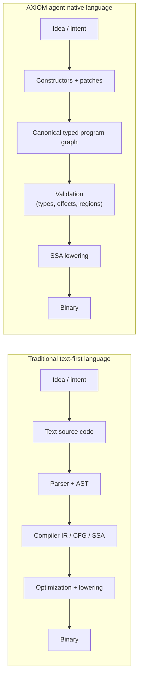

# AXIOM

AXIOM is a specification for an agent-native systems programming language designed for autonomous code generation, structural program transformation, and deterministic native compilation.

The repository is currently in the specification and planning stage. It does not yet contain a compiler or runtime implementation.

AXIOM is being designed around a canonical typed program graph, explicit effects, ownership-centered memory, structured concurrency, and machine-verifiable language semantics.

## Why AXIOM Is Different

Most programming languages are text-first: humans write syntax, and the compiler has to recover program structure from that text before it can optimize or emit machine code.

AXIOM is graph-first: the canonical typed program graph is the source of truth, and compilation becomes a process of validating and lowering structure rather than reconstructing it from syntax.

This shift changes the programming model in a few important ways:

| Aspect | Traditional language pipeline | AXIOM pipeline |
|------|------|------|
| Source of truth | Text source code | Canonical typed program graph |
| Program creation | Writing syntax | Constructing structures |
| Compiler role | Recover structure from text | Validate and lower structure |
| Refactoring model | Text diffs and edits | Structural patches |
| Agent ergonomics | Indirect and syntax-bound | Direct and semantic |

In practice, AXIOM treats the internal graph model that modern compilers already depend on as the primary representation instead of a hidden implementation detail. That is what makes semantic patches, deterministic transformations, persistent program graphs, and agent-native tooling first-class rather than bolted-on.

## Repository Layout

- `spec/` — normative machine-consumable YAML specifications for the language
- `docs/` — human-facing architecture notes, planning material, and document index
- `docs/architecture/architecture-comparison.md` — architectural comparison between text-first and graph-first language design
- `docs/planning/language-creation-plan.md` — phased implementation roadmap
- `docs/planning/required-skills.md` — capability map and required skills by implementation phase
- `assets/` — repository presentation assets such as the social preview
- `CLAUDE.md` — project-oriented repository notes for agent workflows

## Current State

- Repository maturity: specification and planning only
- Phase 0 semantics are being defined for modules, packages, and editions
- Phase 1 formal specification work has started
- The canonical typed program graph is the normative program representation
- Surface syntax is a derived artifact, not the source of truth

## Recommended Reading Order

1. `spec/scope.yaml`
2. `spec/agent-language-design.yaml`
3. `docs/architecture/architecture-comparison.md`
4. `docs/planning/language-creation-plan.md`
5. `docs/planning/required-skills.md`

## Near-Term Deliverables

- Complete `spec/modules.yaml`
- Expand the spec set with `types.yaml`, `effects.yaml`, `errors.yaml`, `memory.yaml`, `concurrency.yaml`, `abi.yaml`, `determinism.yaml`, `validation.yaml`, and `ir.yaml`
- Begin Phase 2 work on the canonical program graph and patch model

## License

This repository is proprietary. See `LICENSE`.
