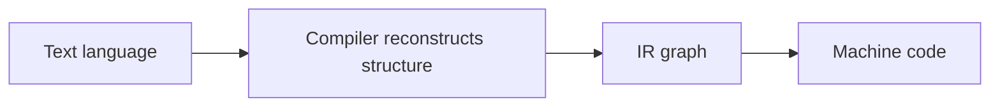
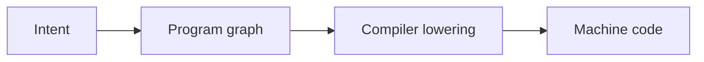

# From Text-First Programming to Agent-Native Programming

This document illustrates the architectural shift from traditional **text-first programming languages** to an **agent-native, graph-first programming model**.

The key idea is that modern compilers already transform text into an internal program graph (IR).
In the proposed architecture, the **program graph becomes the primary representation**, eliminating the need for text as the source of truth.

---

# 1. Traditional Programming Architecture (Today)

In today's programming languages, the human writes **text**, and the compiler reconstructs the program structure from it.

```mermaid
flowchart TD
    A[Human idea]
    B[Mental model of program]
    C[Text source code<br>(Python / Go / Rust / C++)]
    D[Parser]
    E[AST<br>(Abstract Syntax Tree)]
    F[Compiler IR<br>(SSA / Graph / CFG)]
    G[Optimization passes]
    H[Lower IR]
    I[Machine code]
    J[Binary executable]

    A --> B --> C --> D --> E --> F --> G --> H --> I --> J
```

## Properties of this model

- **Text is the source of truth**
- Compilers must **reconstruct program structure**
- AST and IR are **internal representations**
- Structural intent is **implicit in syntax**

In reality, the *actual program* that runs on the machine is closer to the **IR graph** than to the original text.

---

# 2. Agent‑Native Programming Architecture

In an agent-native system, the program is constructed **directly as a structured graph**, without passing through a textual representation.

```mermaid
flowchart TD
    A[Human idea]
    B[Agent intent]
    C[Program graph construction<br>(constructors / patches)]
    D[Canonical typed program graph]
    E[Validation<br>(types / effects / regions)]
    F[Lowering to SSA]
    G[Machine IR]
    H[Native code]
    I[Binary executable]

    A --> B --> C --> D --> E --> F --> G --> H --> I
```

## Properties of this model

- **Graph is the source of truth**
- Programs are built via **structural operations**
- The compiler **lowers structure instead of reconstructing it**
- Validation occurs **before compilation**
- Agents interact through **semantic constructors and patches**

---

# 3. Architectural Comparison

| Aspect | Traditional Languages | Agent‑Native Language |
|------|------|------|
| Source of truth | Text | Canonical program graph |
| Program creation | Writing syntax | Constructing structures |
| Compiler role | Recover structure | Lower structure |
| Refactoring | Text diff | Structural patch |
| Tooling | Editors + compilers | Semantic construction layer |
| AI friendliness | Low | High |

---

# 4. Key Insight

Modern compilers already operate on graph-based IR:

- LLVM IR
- MLIR
- Sea-of-Nodes
- SSA graphs

However, programmers never interact with these structures directly.

The proposed architecture makes the shift:



to:



---

# 5. Conceptual Summary

Traditional programming:

```
idea → text → compiler reconstructs structure → binary
```

Agent-native programming:

```
idea → structure → compiler lowers structure → binary
```

This eliminates the need for the compiler to infer structure from syntax and aligns program creation with how modern compilers actually represent programs internally.

---

# 6. Implications

This architecture enables:

- **structural program diffs**
- **safe semantic patches**
- **agent-driven code synthesis**
- **persistent program graphs**
- **deterministic transformations**
- **formal verification workflows**

It shifts programming from **writing syntax** to **constructing verified program structures**.
